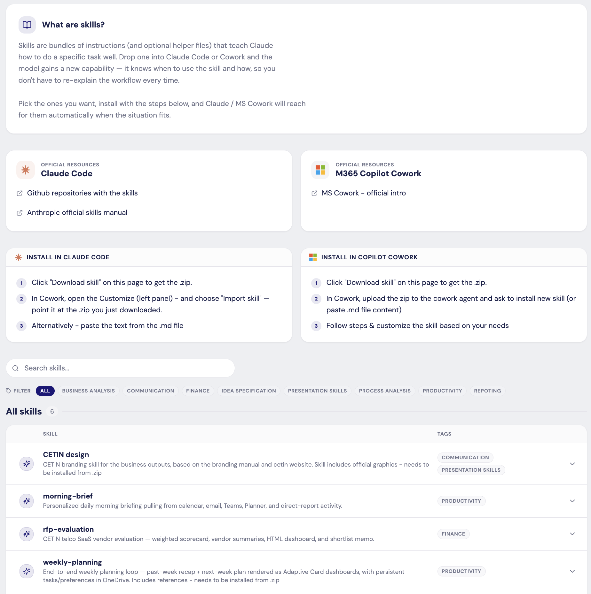

# skills

Public repository of the **skills** I'm using day-to-day (and skills I've helped prepare for colleagues).

> **Note:** These skills were originally tailored for [CETIN](https://www.cetin.cz/) — branding, internal tooling, and workflows are specific to that context. You're welcome to **fork this repo and adapt them to your own organization and processes**. That's the whole point of sharing them.

Maintained by **Jiří Forman** — [LinkedIn](https://www.linkedin.com/in/jiriforman/).

## What are skills?

Skills are bundles of instructions (and optional helper files) that teach Claude how to do a specific task well. Drop one into **Claude Code** or **Microsoft 365 Copilot Cowork** and the model gains a new capability — it knows *when* to use the skill and *how*, so you don't have to re-explain the workflow every time.

## Browse the catalog

The canonical, always-up-to-date catalog (with search, tag filters, and one-click `.zip` downloads) lives here:

**👉 [ailearning.jforman.cz/skills](https://ailearning.jforman.cz/skills)**

Source for the catalog site: [jiriforman/ailearningpath](https://github.com/jiriforman/ailearningpath)

## How to install a skill

### In Claude Code

1. On the [catalog page](https://ailearning.jforman.cz/skills), click **Download skill** on the one you want — you'll get a `.zip`.
2. In Claude Code, open the **Customize** panel (left side) and choose **Import skill**, pointing it at the `.zip`.
3. Alternatively: open the `.md` file inside the `.zip` and paste the text into Claude Code.

### In Microsoft 365 Copilot Cowork

1. On the [catalog page](https://ailearning.jforman.cz/skills), click **Download skill** to get the `.zip`.
2. In Cowork, upload the `.zip` to the agent and ask it to install a new skill (or paste the `.md` content directly).
3. Follow the prompts and customize the skill to your needs.

### Official references

- **Claude Code:** [official skills documentation (Anthropic)](https://docs.claude.com/en/docs/claude-code/skills)
- **M365 Copilot Cowork:** [official intro](https://learn.microsoft.com/en-us/microsoft-365-copilot/)

## Using this repo

Anyone is welcome to:

- **Fork** this repo and adapt skills for your own organization or workflow.
- **Open an issue** to suggest a new skill or report a problem with an existing one.
- **Open a pull request** to contribute a new skill or improve an existing one.

See [CONTRIBUTING.md](CONTRIBUTING.md) for a step-by-step contributor's guide (friendly to GitHub newcomers).

## Contact

Questions, feedback, or want to share a skill you've adapted? Reach out:

- **LinkedIn:** [linkedin.com/in/jiriforman](https://www.linkedin.com/in/jiriforman/)
- **Issues:** [open one here](https://github.com/jiriforman/skills/issues/new)

## License

This repository is licensed under the terms of the [LICENSE](LICENSE) file at the root of the project.
